## links
* 论文链接：[Testing Gremlin-Based Graph Database Systems via Query Disassembling | Proceedings of the 33rd ACM SIGSOFT International Symposium on Software Testing and Analysis](https://dl.acm.org/doi/10.1145/3650212.3680392#:~:text=In%20this%20paper%2C%20we%20propose%20Query%20Di%20sassembling,to%20automatically%20detect%20logic%20bugs%20in%20Gremlin-based%20GDBs.)
* PPT链接：[幻灯片 1](https://is.cas.cn/ztzl2016/2024xsnh/2024hbzs/202408/P020240828552102655927.pdf)
* QuDi工具源码链接：[Testing Gremlin-Based Graph Database Systems via Query Disassembling](https://zenodo.org/records/12771889)

## Authors
Institute of Software at CAS, China(中科院)
Yingying Zheng∗, Wensheng Dou∗†‡
## 0 Abstract
Graph Database Systems (GDBs) support effciently storing and retrieving graph data, and have become a critical component in many important applications. **Many widely-used GDBs utilize the Gremlin query language** to create, modify, and retrieve data in graph databases, in which developers can assemble a sequence of Gremlin APIs to perform a complex query. However, incorrect implementations and optimizations of GDBs can introduce **logic
bugs**, which can cause Gremlin queries to return incorrect query
results, e.g., omitting vertices in a graph database.

In this paper, we propose **Query Disassembling (QuDi), an effective testing technique to automatically detect logic bugs in Gremlin-based GDBs.** Given a Gremlin query Q, QuDi disassembles Q into a sequence of atomic graph traversals TList, which shares the equivalent execution semantics with Q. If the execution results of Q and TList are different, a logic bug is revealed in the target GDB. We evaluate QuDi on six popular GDBs, and have found 25 logic bugs in these GDBs, 10 of which have been confirmed as previously-unknown bugs by GDB developers.

Keywords: Graph database systems, graph traversal, logic bug, bug detection

背景和问题：图数据库系统（Graph Database Systems, GDBs）能够高效地存储和检索图数据，并已成为许多重要应用中的关键组件。许多广泛使用的GDBs采用Gremlin查询语言来创建、修改和检索图数据库中的数据，开发者可以通过组合一系列Gremlin API来执行复杂的查询。然而，GDBs的错误实现和优化可能会引入逻辑错误，导致Gremlin查询返回错误的结果，例如遗漏图数据库中的某些顶点。

方法：在本文中，**我们提出了一种有效的测试技术——查询分解（Query Disassembling, QuDi），用于自动检测基于Gremlin的GDBs中的逻辑错误。给定一个Gremlin查询Q，QuDi将Q分解为一系列原子图遍历操作TList，这些操作与Q具有等效的执行语义。如果Q和TList的执行结果不同，则表明目标GDB中存在逻辑错误。** 我们在六个流行的GDBs上评估了QuDi，并发现了25个逻辑错误，其中10个已被GDB开发者确认为此前未知的错误。

## 1 Introduction

### 1.1 图数据库系统（Graph Database Systems, GDBs）
* GDBs定义：支持高效的图数据存储和查询，图数据由顶点和边组成。
* GDBs重要应用场景：社交网络[35]、知识图谱[26, 45]和欺诈检测[50]。
* GDBs应用广泛：最新的DB-Engines图数据库排名[3]显示目前已有41个广泛使用的GDBs。

### 1.2 Gremlin: procedural Gremlin query language
* declarative Structured Query Language: relational database systems使用声明式的结构化查询语言访问关系数据。 
* procedural query language: **GDBs没有标准化的方式来访问图数据，通常使用自己的查询语言**，例如NebulaGraph中的nGQL[11]和TigerGraph中的GSQL[32]。
* Gremlin-based GDBs: 在DB-Engines排名[3]中，约有一半的GDBs支持Gremlin查询语言。
* Gremlin特点:  Gremlin查询语言提供了一组Gremlin API，用于创建、修改和检索图数据。
* **Gremlin中逻辑错误的诱因：为提高查询的性能，GDBs采用复杂的执行和优化策略（例如重新排序过滤操作以优先执行成本较低的操作，以及合并过滤条件以实现高效的图查询）。这种GDBs的错误实现和优化可能会引入逻辑错误。**

### 1.3 本文工具检测到的示例逻辑错误：ArcadeDB#500， Gremlin
* 查询语句解释：g.V()检索fig2 中所有顶点->保留标签为person且age属性小于30的顶点->保留有标签person或者book的顶点
* 正确查询结果：{1,4}
* 返回查询结果(错误)：{1, 2, 3, 4}
* ArcadeDB开发者的解释：这个逻辑错误是由于多个过滤条件组合的实现错误导致的，并迅速修复了它。（详细解释：问题的原因出在优化层，该层通过拦截索引上的查询并利用索引来加速性能。但在这种情况下，由于存在多个条件，无法单独使用索引。）
* bug链接：[Gremlin api "hasLabel" after "has" returns unexpected result · Issue #500 · ArcadeData/arcadedb](https://github.com/ArcadeData/arcadedb/issues/500)
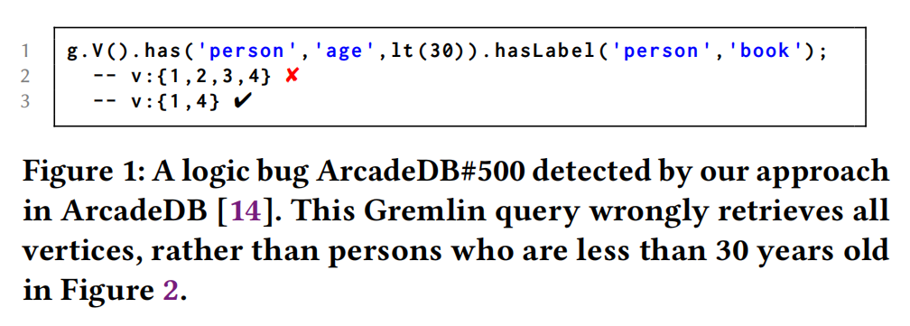

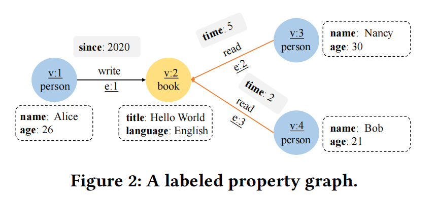

> [!NOTE]  ArcadeDB#500解释
> 这条查询：
g.V().has('vl1', 'vp1', lt(2)).hasLabel('vl1', 'vl2', 'vl3').count()
涉及了多个条件，这会导致优化器无法有效地利用索引，从而产生逻辑错误。具体分析如下：
1.查询分解：
`has('vl1', 'vp1', lt(2))`：这表示查找属性 `vl1` 中名为 `vp1` 且值小于 2 的顶点。
 `hasLabel('vl1', 'vl2', 'vl3')`：这个条件要求顶点的标签是 `vl1`、`vl2` 或 `vl3` 中的一个。
2.逻辑错误的原因：
**索引优化的限制**：一般情况下，数据库的查询优化器会尝试利用索引来加速查询。如果存在索引可以加速对 `vl1` 和 `vp1` 属性的查询（例如，基于 `vl1` 和 `vp1` 的联合索引），优化器会尝试使用该索引来快速筛选符合条件的顶点。然而，当查询中有多个条件时，特别是涉及 `hasLabel` 和属性条件的组合时，索引的应用可能变得复杂或无法同时覆盖所有条件。
**多个条件的冲突**：在这个查询中，`hasLabel('vl1', 'vl2', 'vl3')` 需要在查询中应用三个标签条件，而 `has('vl1', 'vp1', lt(2))` 则是一个属性条件，要求 `vl1` 的 `vp1` 属性小于 2。这两部分条件可能会导致优化器无法有效地将索引同时应用到属性查询和标签查询的结合上。
标签 (`hasLabel`) 通常是基于顶点的标签类型进行筛选，而属性 (`has`) 查询是基于顶点的属性进行筛选。由于这两个条件的过滤方式不同，优化器可能无法找到一种高效的方式来同时使用索引，从而导致查询性能下降或者不能使用索引来加速查询。
**结论**：该查询的逻辑错误源于查询条件中涉及多个不同类型的过滤（属性和标签），导致索引优化器无法同时有效地使用索引。需要通过优化查询逻辑或调整索引设计来避免这个问题。

### 1.4 现有工作及局限性

1. GDB的逻辑错误检测的挑战
* 缺乏一种有效的测试预言来自动测试并验证GDB在给定Gremlin查询下的行为是否正确。
* 针对关系型数据库系统的测试预言[27, 30, 37, 51–53, 56, 57]，无法直接应用于基于Gremlin的GDBs。
2. **差异测试（Differential Testing, DT）**
* 定义：将相同查询输入到多个 GDBs 中，旨在发现它们之间的不一致结果。
* **GDsmith [北大]**：首次使用差异测试检测基于Cypher的GDB
	* GDsmith 采用了**骨架生成和补全技术**确保随机生成的 Cypher 查询满足语义要求，利用**三种结构变异策略**增加返回非空结果的 Cypher 查询的概率，并**根据属性键的先前频率动态选择属性键以提高生成的 Cypher 查询的行为多样性**。GDsmith 成功地在三个流行的开源图数据库引擎的发布版本上检测到 27 个先前未知的漏洞。
* **Grand [中科院技术研究所]**：首次使用差异测试检测基于Gremlin的GDB
	* Grand，一种用于自动发现采用Gremlin检索图数据的图数据库系统中逻辑错误的随机差异测试方法，并在六种广泛使用的图数据库系统中发现了21个先前未知的逻辑错误。
	- 技术路线:为多个GDBs构建语义等价数据库；基于模型的查询生成方法来生成可能返回非空结果的有效Gremlin查询；使用数据映射方法统一不同GDBs的查询结果格式。
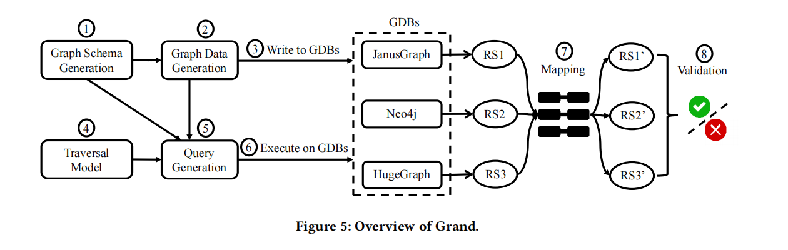
* RD2 [62], [幻灯片 1](https://is.cas.cn/ztzl2016/2023xsnh/2023hbzs/202309/P020231228505999042717.pdf)
* 局限性：**所有 GDBs 返回相同的结果并不一定意味着正确性。** 使用不一致性作为差异测试的测试预言（oracle）会带来两个问题：  
	* 被测GDBs 可能存在相同逻辑错误：它无法检测所有被测试 GDBs 中都存在的错误，因为这些 GDBs 可能始终返回相同的不正确结果  
	* 被测功能有限：只能测试被测 GDBs 之间重叠的通用功能，而无法测试特定 GDB 的独特功能

3. **蜕变测试（Metamorphic Testing, MT）**
* 定义：精心设计蜕变关系（Metamorphic Relations，MRs），对输入进行变异，检查输出是否违反所规定的属性来检测错误。蜕变关系缓解了差异测试预言的问题，不需要存在多个类似的程序实现
* GDBMeter[34] : 
	* GDBMeter 是唯一采用蜕变测试（Metamorphic Testing，MT）的图形数据库测试工具。它将关系数据库中使用的三元查询分区（ternary query partitioning，TLP ）[42] 的思想移植到 GDB 中。它将给定的查询拆分为三个派生子查询，其中谓词分别被评估为 `TRUE`、`FALSE` 和 `IS NULL`。然后，它验证派生结果集的并集与原始结果集之间的一致性。
* 局限性：**现有的蜕变测试（MT）解决方案上述方法都是为使用SQL类或其他图查询语言的数据库系统设计的，并未关注 GDBs 中的图原生结构，因此未能提出一套图感知的MR，这限制了它们的有效性**。  
	* 覆盖语法有限（局限一）：GDBs 的图查询语言包含了与图原生结构相关的丰富语法，而现有的 MT 方法仅覆盖了有限的语法。例如，常用的路径遍历（path traversal）语法和 `𝑢𝑛𝑖𝑜𝑛` 子句在之前的工作中并未得到支持。  
	* 缺乏针对图形原生结构的有效测试预言（局限二）：不能充分识别与图形原生结构相关的逻辑错误。GDBMeter 直接复用关系数据库系统中的三元查询分区方法，而没有分析图形数据库独特的图形原生结构，因此无法全面测试图形数据库。

> [!NOTE] 相关工作论文笔记
> * [GDsmith：Detecting Bugs in Graph Database Engines 论文笔记_detecting transactional bugs in database engines v-CSDN博客](https://blog.csdn.net/qq_38135755/article/details/144200584)
> * Grand: [Finding Bugs in Gremlin-Based Graph Database Systems via Randomized Differential Testing | LinLi's Blog](https://linli1724647576.github.io/2024/03/01/Finding-Bugs-in-Gremlin-Based-Graph-Database-Systems-via-Randomized-Differential-Testing/)
> * GDBMeter: [Testing Graph Database Engines via Query Partitioning 论文笔记-CSDN博客](https://blog.csdn.net/qq_38135755/article/details/144200617?spm=1001.2014.3001.5502)

### 1.5 Overview of QuDi
1. **查询分解（Query Disassembling, QuDi）：一种有效的测试预言，用于揭示单个基于Gremlin的GDBs中的逻辑错误。**
2. **test oracle：一个复杂的Gremlin查询可以被分解为一系列原子图遍历操作，这些操作与原始查询具有等效的执行语义，因此应该获得相同的结果。**
3. **Insight：将Gremlin查询分解为一系列原子图遍历，可以防止某些优化策略的介入，从而检测图数据库中的逻辑错误。**
4. QuDi
	* 给定一个Gremlin Q，我们将其分解为一系列原子图遍历操作 TLiist = <T_1,T_2,...,T_n>, 其中T_i表示第i个原子图遍历。
	* 对于TList中的每个原子图遍历T_i，我们构建一个查询，该查询以其前一个遍历T_(i-1)的结果RS_T(i-1)作为输入，并计算其自身的结果RS_T(i)。
	* **test oracle：查询Q的结果RS_Q必须等于TList中最后一个遍历T_n的结果RS_T(n)。提出了三种执行策略来实现这一测试预言。**
5. 实现评估
	* 测试GDB：6个基于 Gremlin 的图数据库
	* 效果：25个逻辑错误。17个逻辑错误已被确认，其中10个被归类为先前未知的错误，7个被归类为现有重复错误。8个错误被GDB开发者修复。
	* 逻辑错误原因：17个已确认的错误中，11个错误是由原子图遍历组合的实现和优化不正确引起的，其余6个错误则是由原子图遍历的实现错误导致的。
6. 总结
	- 我们提出了一种通用（可适用于其他图数据库和关系型数据库皆）且有效的测试预言机——查询拆解，用于发现单个图数据库中的逻辑错误。通过将复杂的查询拆解成等效的原子图遍历序列，揭示与 Gremlin 查询在图数据库中实现和优化错误相关的逻辑缺陷。
	- 在六种广泛使用的图数据库上评估了 QuDi。总共发现了 25 个逻辑错误，其中 10 个已被图数据库开发者确认是之前未发现的错误。

## 2 Preliminaries
### 2.1 Labeled Property Graph Model（标记属性图模型）

* 图形数据库系统通常使用标记属性图模型(Labeled property graph model [44])来表示其图形结构。
* 该模型包含一组节点(nodes)和与这些节点相关联的一组边(edges)。
* 每个节点或边都有一个附加的标签(labels)，用于将其划分到特定的组中。同时，一组键值对属性(key-value pair attributes)用于描述节点或边的特性并提供额外的元数据。

### 2.2 Gremlin Query Language
1. 不同的图形数据库支持不同的图形查询语言。例如，Neo4j 开发了 Cypher，TinkerPop 开发了 Gremlin，TigerGraph 开发了 GSQL，ArangoDB 开发了 AQL 等。
2. **根据DB-Engines的图数据库排名，Gremlin是最受欢迎且广泛使用的图查询语言之一，大约半数的41个图数据库支持Gremlin。** 
3. **Gremlin**
	* 一种函数式语言（a functional language），遍历操作符被链接在一起形成类似路径的表达式。一个 Gremlin 查询由一系列 Gremlin 遍历原语组成，最终计算出最终的输出结果。
	* 示例：`g.V().where(values('name').is(eq('Alice'))).outE('created').inV().hasLabel('software').values('lang')`。该查询首先使用 `g.V()` 获取所有节点，然后使用 `where()` 和 `eq()` 过滤出名字为 Alice 的节点。通过使用 `outE('created').inV()` 遍历边，可以访问 Alice 创建的软件。最后，通过 `hasLabel()` 和 `values()` 返回软件的语言。在这个示例中，`where()` API 中存在一个嵌套查询，其中 `is()` 用于评估属性值是否与谓词匹配。

### 2.3 Gremlin Traversal Model（来自Grand）
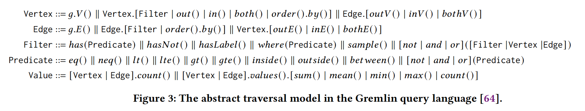
1. Gremlin遍历模型：阐释如何构建有效的Gremlin查询。
2. 该模型的关键见解：查询中一个Gremlin API的输入类型应与其前一个Gremlin API的输出类型相匹配。
3. 模型说明
	* Vertex描述了返回顶点列表的操作。例如，Gremlin API V()可以从图数据库中检索所有顶点并返回一个顶点列表。
	* Edge代表返回边列表的操作。例如，可以使用g.V().outE()来检索图数据库中所有顶点的出边。
	* Filter是一组过滤操作。例如ℎas()和ℎasLabel()，它们映射满足给定过滤条件的实体。属于Filter的操作可以组装在Vertex和Edge之后，并分别返回顶点列表和边列表。例如，如果我们将g.V()和ℎas()组装在一起，组装后的查询g.V().ℎas()也会返回一个顶点列表。
	* Predicate包含一组谓词操作。例如用作Filter参数的lt()。
	* Value描述了返回值或值列表的操作。例如，我们可以通过g.V().values()检索顶点的属性。
### 2.4 Gremlin Query Execution
1. GRM：Gremlin查询由Gremlin遍历机（Gremlin Traversal Machine，GTM）处理。
2. GTM优化策略
	* 作用：旨在根据访问图数据的成本确定最优的执行计划。例如，优化策略可以重新排序过滤操作，以先执行成本较低的过滤器（即FilterRankingStrategy），或者合并操作以实现高效搜索（即IncidentToAdjacentStrategy）。

## 3 Approach
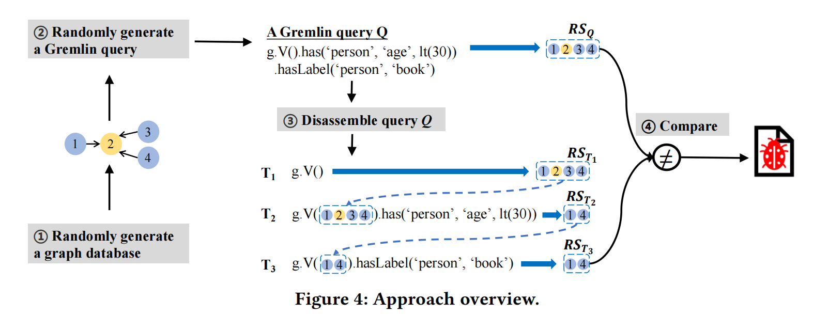
1. 随机生成一个图数据库
2. 随机生成Gremlin查询Q
3. 计算Gremlin查询Q的结果集，分解Q为一个原子图遍历序列
4. 比较结果
### 3.1 Graph Database and Query Generation(基于Grand)
基于 Grand 生成随机图数据库和随机 Gremlin 查询。
#### 3.1.1 Graph database generation
5. 随机生成图模式
	* 顶点类型 `<label, propertyType* >`。随机生成标签名称和属性集合来生成顶点类型。
	* 边类型 `<label, propertyType*, inVType, outVType>`。 随机生成一个标签名称和属性类型集来定义边类型，并随机选择一个顶点类型作为其入（出）顶点类型。
	* `propertyType` 包含属性名称和数据类型。每个属性包含一个随机的属性名称和数据类型。
#### 3.1.2 Graph query generation
基于图 3 的抽象遍历模型随机生成 Gremlin 查询。
* 边界：反复选择遍历类型，直到达到 图遍历长度 L 或选择了一个值类型（Value）。
* 单次迭代
	* 随机选择一个遍历类型（例如，Filter）
	* 在该类型下随机选择一个 Gremlin API（例如，`has()`）。其输出类型传递到下一次迭代中，作为下一次的输入类型。
	* Gremlin API 参数：随机选取或生成属性名称和属性值。
### 3.2 Query Disassembling
6. 原子图遍历（an atomic graph traversal）
	* 定义：一组 Gremlin API 调用，这些调用返回一个类型为顶点（Vertex）或边（Edge）的结果集 。例如 `g.V()`、`has(lt())` 和 `hasLabel()`。
	* 特性
		* 一组API。
		* 返回的结果集类型为顶点或边，且其任何子序列的 Gremlin API 调用都不能返回类型为顶点或边的结果集。
		* 可独立执行。
		* 最后一个图遍历：将 Gremlin 查询末尾用于计算顶点或边的值的所有 Gremlin API 调用视为最后一个图遍历。
	* 示例
		* `g.V().has('person', 'age', lt(30))` 可以拆解为`g.V()` 和 `has('person', 'age', lt(30))`两个原子图遍历。
		* 将 `values('age').sum()` 视为查询 `g.V().values('age').sum()` 的最后一个图遍历。
	* Gremlin Traversal Model中的原子图遍历
		* Vertex，Edge：返回值满足
		* Filter：保持其前一个图遍历的顶点或边类型。
7. 查询分解算法
	*  atomicT：存储每一组原子图遍历，每次迭代清空。
	* 第3行从 Q 中提取 Gremlin API 调用。
	* 第 7-9 行：检查是否可以在其后进行拆解。
	* 第 11-12 行：处理最后余留的API。
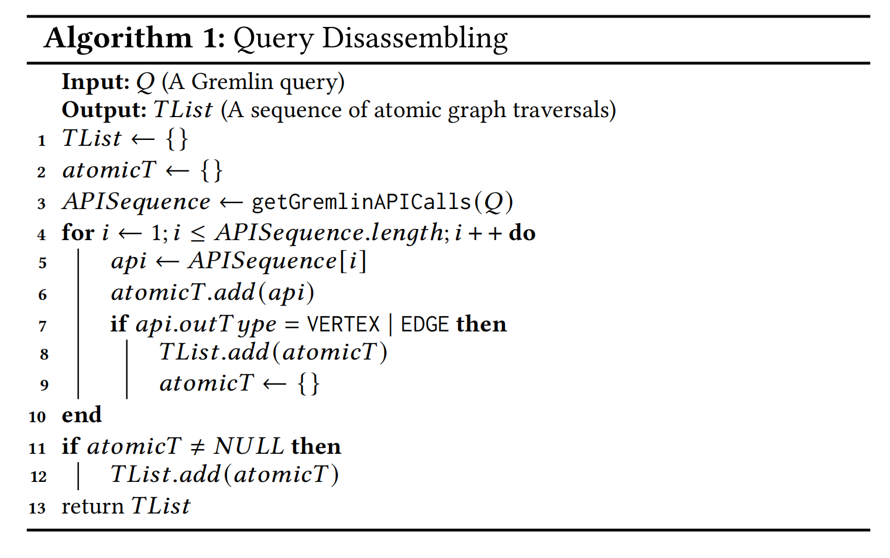
### 3.3 Atomic Traversal Execution
8. 拆解查询（disassembled query）
	* 定义：对于TList 中的每个原子图遍历 T_i，为其构造Gremlin 查询 Q_i 以计算其中间结果 RS_T{i}。需要获取RS_T{i-1} 作为Q_i输入。
	* 注意：对于起始遍历 `g.V()` 和 `g.E()`，我们不需要为其构造额外的查询。
	* 三种执行策略，即参数传递策略（parameter passing strategy）、临时 ID 表策略（temporary ID table strategy） 和屏障策略（barrier strategy）。
#### 3.3.1 Parameter Passing Strategy
9. 数据结构：将原子图遍历 T_{i-1} 的中间查询结果存储到一个 ID 列表 idList 中，该列表包含一组组顶点 ID 或边 ID。
10. 策略内容：遍历到 T_i 时，从 idList 中检索中间结果，并将其作为参数传递给 Gremlin API。
11. 获取顶点和边的函数： `V(idList)`（根据顶点 ID 列表获取顶点）或 `E(idList)`（根据边 ID 列表获取边）。
12. 示例
	* 将第二个原子图遍历的中间结果存储为一个顶点 ID 列表 `{1, 4}`（第 2 行）。
	* 执行第三个原子图遍历时，首先检索顶点列表 `{1, 4}`，然后将其作为 `V()` 的参数，即 `g.V(1, 4)`。
	* 在 `g.V(1, 4)` 后附加第三个原子图遍历 `hasLabel('person', 'book')`（第 3 行）。
	* 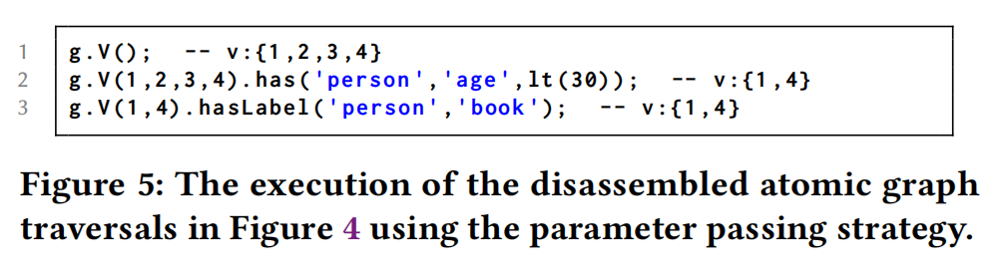
13. 策略优缺点
	* 可以有效地禁用复杂的查询组合和优化，从而高 效地检测逻辑错误。
	* 受限于 `V()` 和 `E()` API 的参数大小，因此不适用于大型图数据库。例如，JanusGraph 限制 `V()` 或 `E()` 中 ID 列表的大小为 255。（实验表明，所有 25 个检测到的逻辑错误都可以通过少量图数据触发，即在图数据库中最多包含 3 个顶点和 2 条边。）
#### 3.3.2 Temporary ID Table Strategy
14. 数据结构：将中间结果存储到一个临时表 vList中。从 T_{i-1} 的中间结果 RS_T{i-1} 中提取一个 ID 列表 idList，**然后将列表中的每个 ID 存储到图数据库中新创建的一个对应顶点中**，这样得到一个新创建的顶点列表 vList。vList 中的每个顶点都有一个标签 `IDs`，并且有一个属性 `id` 来存储 idList 中的 ID。
15. 策略内容
	* 执行图遍历 T_i 时，**构造一个查询，借助 vList 来检索 T_{i-1} 的结果集，并继续执行 T_i**。
	* **需要构建了一个复杂的 Gremlin 查询来检索中间结果。**
	* **使用完这些表示结果集的中间顶点后会删除它们。**
16. 示例（以 `hasLabel('person', 'book')`为例）
	* 第2-3行：将 T_2 的结果集 v:{1,4} 后存储到一个顶点标签为 `IDs` 的表中。
	* 第6行：从图数据库中获取所有标签为 `'IDs'` 的顶点，并提取这些顶点的 `'id'` 属性值，将这些属性值命名为 `vList`。
	* 第7-9行：从图数据库中的所有顶点中检索那些 ID 在 vList 中的顶点（`where` 子句执行一个过滤条件，比较 `'vList'` 中的值与 `'V_ID'` 是否相等。`P.eq('V_ID')` 是一个条件操作符，表示 `'vList'` 中的元素必须等于 `'V_ID'`）。
	* 第10行：执行 T_3 来计算其结果集 v:{1,4}。
	* 第13行：删除创建的顶点。
	* 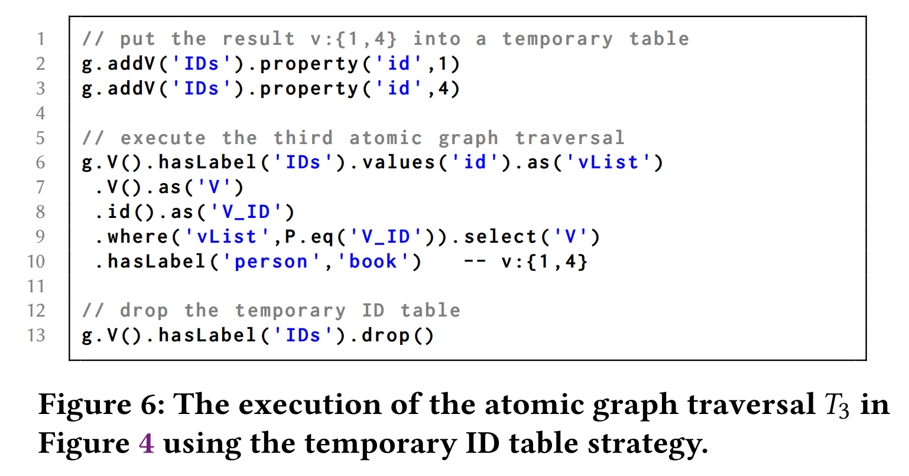
	* 
17. 策略优缺点
	* 可以避免参数传递策略的缺点，例如 Gremlin API 中 `V()` 和 `E()` 参数大小的限制。
	* 思路可以在其他数据库系统中普遍应用（见第 5 节）。
	* 然而，这种策略**有更高的时间代价**，因为需要更多的操作来存储或删除图数据库中的中间结果。
	* 引入了用于检索中间结果的额外原子图遍历，可能会漏掉与这些遍历相关的 bug。
#### 3.3.3 Barrier Strategy
18. 策略内容
	* 核心思想：Gremlin API 中的 `barrier()` 可以将 Gremlin 查询的lazy pipeline转换为bulk-synchronous pipeline（批量同步）。
	* **在 `barrier()` 操作之前的图遍历需要先执行，然后才能进行 `barrier()` 操作之后的图遍历。**
	* 在原子图遍历 `Tᵢ₋₁` 后附加一个 `barrier()` 操作时，**`barrier()` 操作可以禁用原 Gremlin 查询中 `Tᵢ₋₁` 和 `Tᵢ` 的组装。**（注，最后一个原子图遍历后不需要附加 `barrier()` 操作）
19. 示例
	* 在第一个和第二个原子图遍历后附加 `barrier()` 操作，**构造拆解后的查询**，执行它以计算拆解后的原子图遍历序列的结果集。
	* 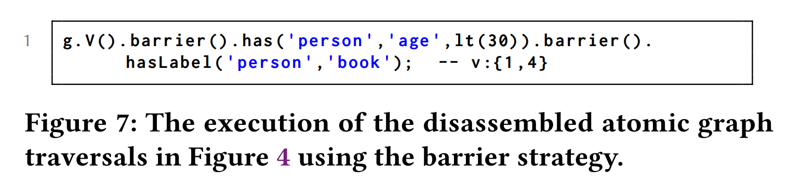
20. 策略优缺点
	* 该策略可以禁用 Gremlin API 的组装并防止一些优化的生效
	* 但它本身引入了批量操作和批量优化（当多次接触到相同的元素时，`barrier()` 操作只能执行这个元素一次）。因此，这个策略无法像其他两种执行策略那样禁用更复杂的查询组装和优化，因此某些逻辑错误可能会被遗漏。（在实验中通过该策略检测到的一个错误，其他两种策略无法检测到。障碍策略可以补充其他两种策略。）
## 4 Evaluation
21. Grand 上实现了 QuDi，代码大约有 1000 行 Java 代码。
22. 为 Grand 中使用的遍历模型添加了一些通用的 Gremlin API，例如 `sample()` 和 `barrier()`。
23. 
	* RQ1：QuDi 在检测实际图数据库中的逻辑错误方面有多有效？ 
	* RQ2：QuDi 中提出的三种执行策略在检测逻辑错误方面表现如何？ 
	* RQ3：QuDi 与现有的最先进方法在错误检测能力方面有何比较？
### 4.1 Methodology
####  4.1.1 Target GDBs
24. 目标Gremlin-based GDBs：Neo4j 3.4.11（与最新的Neo4j-Gremlin 3.6.1版本）、OrientDB 3.2.10、JanusGraph 0.6.2、HugeGraph 0.12.0、TinkerGraph 3.6.1和ArcadeDB 22.8.1。
#### 4.1.2 Testing methodology
25. 测试10轮：使用三种执行策略，分别对每个目标图数据库进行10轮测试。
26. Graph Database and Query Generation：为目标图数据库随机创建一个最多包含50个顶点和100条边的图数据库，并随机生成1,000个Gremlin查询。
#### 4.1.3 Simplify test cases
对于每个报告的逻辑错误，手动（删减每个遍历步骤，看是否依旧能触发）将测试用例简化为更小的用例，以便更容易理解和诊断错误。
#### 4.1.4 Deduplicate test cases
手动分析简化后的报告逻辑错误的测试用例，其查询模式和错误后果，对比已确定的用例，去重。
### 4.2 Detected Bugs
#### 4.2.1 Bug Overview
* 六个GDBs，获得了 3,047 个错误报告。Neo4j、OrientDB、JanusGraph、HugeGraph、TinkerGraph 和 ArcadeDB 分别有 8、20、265、2490、87 和 177 个错误报告。
* 简化并去重后，得到下面的bug数量
* 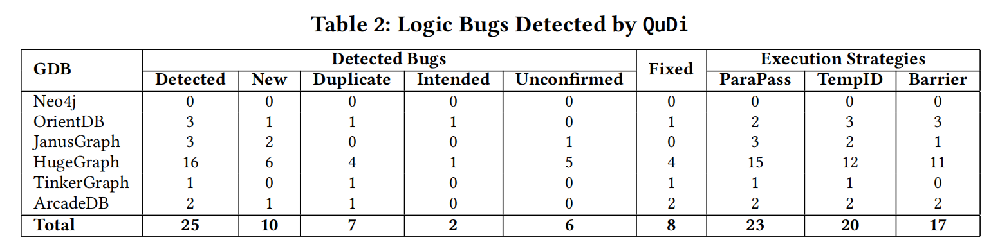
* Intended bugs
	* OrientDB#9885：由于 OrientDB 在对不存在的属性进行排序时忘记抛出异常。尽管 OrientDB 开发者解释称，当访问不存在的属性时，OrientDB 可以返回 `NULL`，但我们仍然认为这是一个真正的错误，因为 OrientDB 有时并不会返回 `NULL`。
	* HugeGraph#1966：当使用 `not(eq())` 过滤属性查询顶点或边时，HugeGraph 返回了不正确的查询结果。HugeGraph 开发者解释HugeGraph 目前不支持 `not-eq` 索引查询。
#### 4.2.2 Bug Analysis
**Bug categories**

这17个已确认的逻辑错误原理中，分为以下两类：
* 原子图遍历的实现不正确（6个）：相关的原子图遍历返回了不正确的结果（如HugeGraph#1946）。
* 原子图遍历的组合实现不正确（11个）：所有使用的原子图遍历可以返回正确的结果，但原子图遍历的组合返回了不正确的结果。有3个与相关原子图遍历组合的错误查询优化有关。
以上两类逻辑错误的发现，源于：
* 一个原子图遍历实现不正确，但包含该原子图遍历的 Gremlin 查询返回正确的结果。
*  QuDi 通过将复杂的 Gremlin 查询拆解为原子图遍历来防止某些优化策略的启用。

**Bug consequences**：根据错误后果将25个逻辑错误总结为三类：
* 不正确的查询结果：两个比较的结果不相等，并且其中一个结果是错误的。
* 缺少异常：本应抛出异常，但却返回了查询结果。
* 意外异常：返回了意外异常，但实际上不应如此。
* 
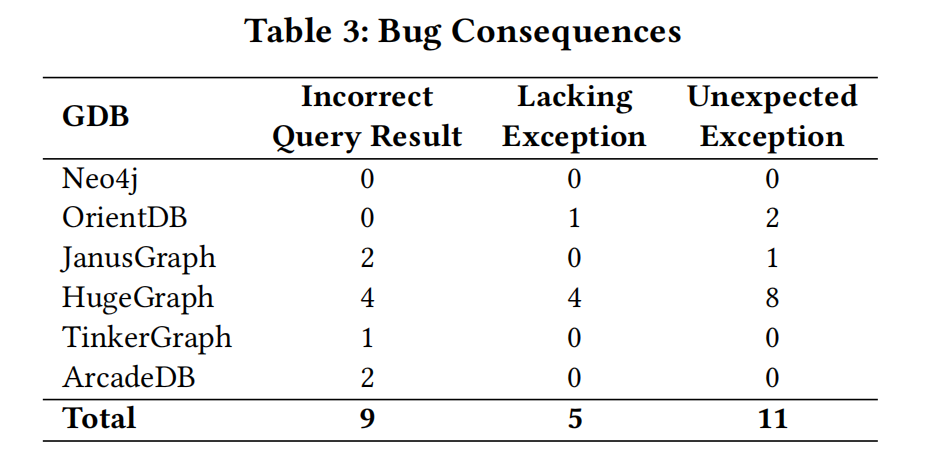Incorrect Query Result: 9=4 New + 3 Duplicate + 2 Unconfirmed
Lacking Exception: 5 = 2 New + 1 Duplicate + 2 Unconfirmed
Unexpected Exception: 11 = 4 New + 7 Others
#### 4.2.3 Execution Strategies Comparison
* 三种执行策略用于存储和使用一系列原子图遍历的中间结果，相互弥补。
* 参数传递策略（简称ParaPass）、临时ID表策略（简称TempID）和屏障策略（简称Barrier）。
* 这三种执行策略的必要性。
	* 仅由ParaPass检测到的4个错误都是通过将中间结果作为Gremlin API `V(idList)` 或 `E(idList)` 的参数传递而触发的。
	* 仅由Barrier检测到的1个错误是由API`barrier()` 的特性触发的。
	* TempID是一种通用策略，可以应用于测试其他数据库系统（第5节），也能处理大规模图数据。

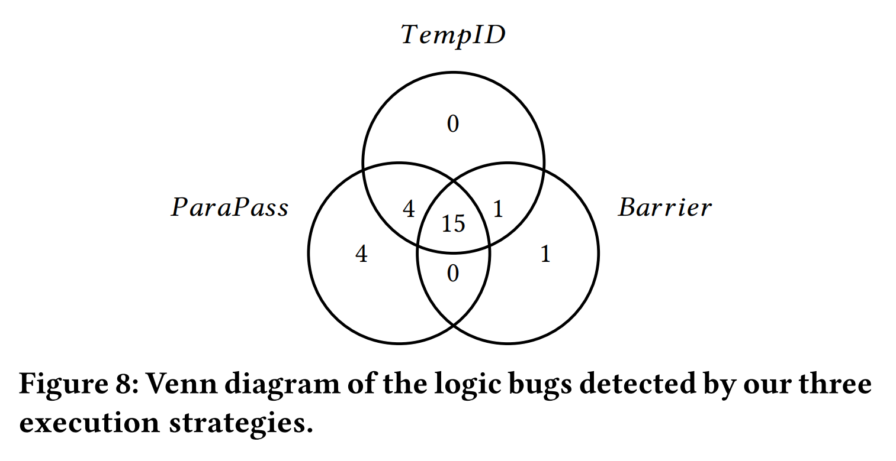
### 4.3 Comparing with Existing Approaches
与Grand [64]、GDsmith [39]、RD2 [62]和GDBMeter [42]对比。
### 4.3.1 Comparison with differential testing
差异测试中会有以下几种结果类型：
- **C1（成功报告错误）**：至少两个图数据库返回不一致的结果，这时差异测试会报告一个错误。
- **C2（遗漏，全部出错误）**：所有图数据库返回相同的错误结果，差异测试可能会错过这个错误。
- **C3（遗漏，部分出错误）**：所有图数据库返回相同的结果，但根据各自的特殊语义，某些图数据库应该返回不一致的结果。在这种情况下，差异测试可能会错过错误。
- **C4（假阳性）**：至少两个图数据库返回不一致的结果，但这种不一致是由于目标图数据库的特殊语义所导致的。在这种情况下，差异测试可能会报告一个假阳性。

QuDi 相较于差异测试具有以下优势：
* QuDi 可以基于单个图数据库检测错误。
* QuDi 可以测试仅由一个图数据库支持的 Gremlin 特性。
* QuDi 用于检测单个图数据库内部的不一致性，因此不会遇到 C3 和 C4 的情况。

对比结果：
* Grand 检测 QuDi 报告的 25 个逻辑错误：可以检测到其中的 19 个逻辑错误。
* QuDi 检测 Grand 报告的 21 个逻辑错误：能够检测到其中的 16 个（76%）逻辑错误。（错过了剩下的 5 个错误，因为它们的原始查询和相应的拆解查询返回了相同的错误结果）
### 4.3.2 Comparison with query partitioning
查询分区类型方法的局限：
* 无法防止图数据库优化的发生，它几乎无法检测到由原子图遍历组装的错误实现和优化引起的逻辑错误。

对比结果：
* GDBMeter 检测 QuDi 报告的 25 个逻辑错误：其中6 个 QuDi 检测到的错误理论上可以被 GDBMeter 检测到。
* QuDi 检测到 GDBMeter 在 JanusGraph（Gremlin） 中报告的 3 个逻辑错误：3 个错误中的 2 个是由查询生成触发的内部错误，而不是由测试预期（例如查询分区和查询拆解）引发的。
### 4.4 Selected Interesting Bugs
**数据类型处理不一致：JanusGraph 在查询没有明确指定数据类型的属性时，会出现不一致的行为**
* 第 1-3 行：创建两个顶点和一条边。
* 第 4 行：向边 e:1 添加一个属性 p，值为 0.94461，类型为 Float。
* 第 7 行：通过过滤条件 p = 0.94461 查询边。
* 第 10-11 行：查询拆解为两个原子图遍历，返回的是一个空集合。
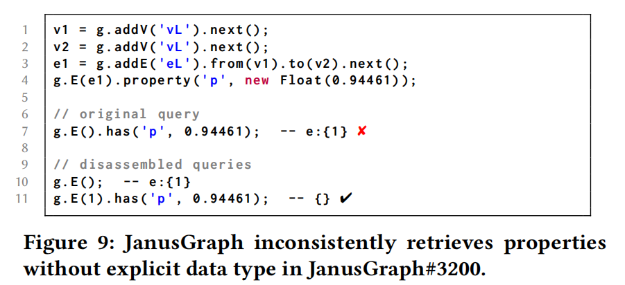

**order() 操作处理不正确：JanusGraph 错误地使用 `order().by()` 排序具有属性的顶点或边（Unconfirmed）**
* 第 1-2 行：创建顶点 v:1 和 v:2，并分别给它们赋予属性 p0 和 p1。
* 第 5 行：按属性 p0 对顶点进行排序时，会抛出异常，因为顶点 v:2 没有属性 p0。JanusGraph 开发人员认为应该根据属性 p0 对顶点进行过滤，而不是抛出异常。
* 第 9 行：拆解查询触发了另一个错误，预期结果应该是 v:{1}，而不是 v:{1, 2}。
* 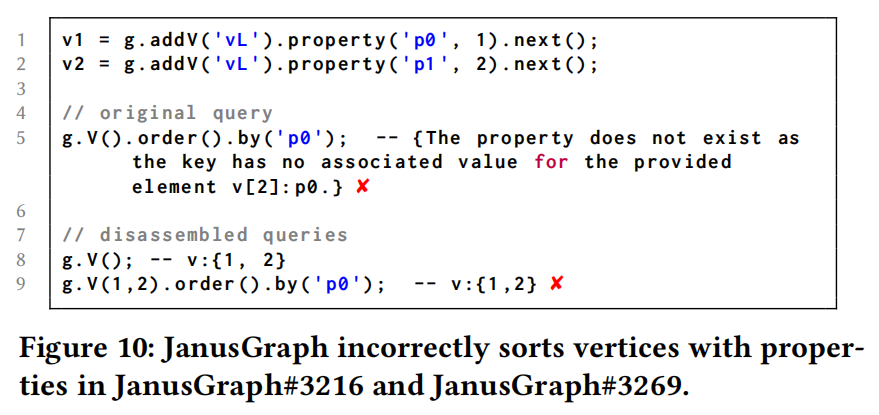

**E() 操作处理不正确：HugeGraph 中 Gremlin API `E()` 实现的不正确示例**
* 第 8 行：我们希望统计所有顶点的入边和出边的数量。预期结果是 4。
* 第 13 行：返回的是错误的结果 2。查询 `g.E(1, 2, 1, 2)` 返回了边列表 `e:{1, 2}`，而不是 `e:{1, 2, 1, 2}`，这导致了错误的结果。
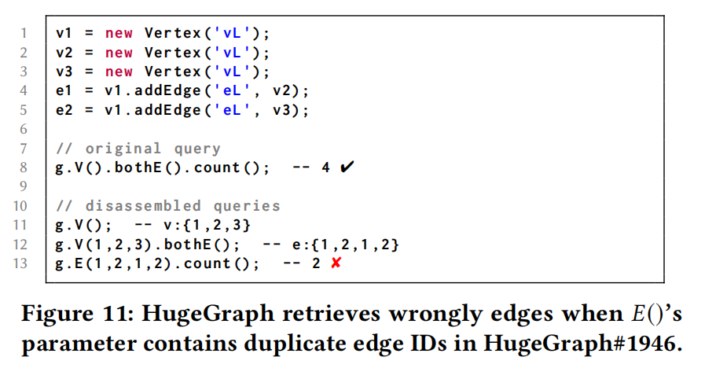
## 5 Discussion
**将 QuDi 泛化到其他数据库系统**
* 到其他GDB语言：
	* Cypher 查询（第2行）:找出所有人 `p` 读的书 `b2`，前提是这个人写了至少一本书 `b1`。
	* 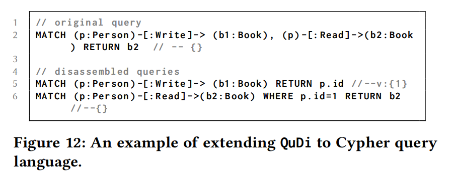
* 到其他关系型数据库查询语言：
	* 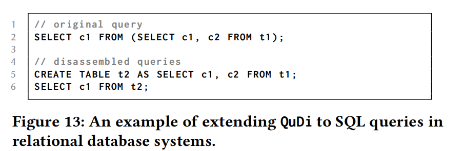

**QuDi局限性**：QuDi 无法检测三种类型的错误：
*  Gremlin 查询 API 中的错误。
* 无法检测与 Gremlin 中顶点计算相关的 API 错误，这些 API 执行的是更复杂的操作，无法直接进行拆解。
* 原始查询和其拆解后的查询返回相同的错误结果。
## 7 Conclusion

* Gremlin 基于图数据库系统的错误实现和优化可能引入逻辑错误。
* 本文提出查询拆解（QuDi）方法，通过将复杂的 Gremlin 查询拆解为等效的原子图遍历序列，揭示图数据库系统中的逻辑错误。
* 在六个广泛使用的图数据库系统上评估了 QuDi，发现了 25 个独特的逻辑错误，其中 10 个是此前未知的错误。